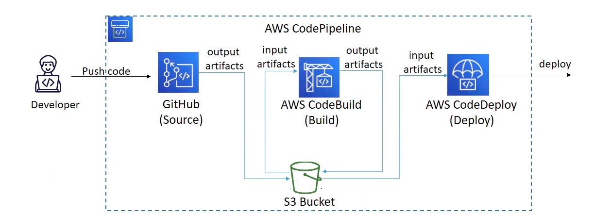

# Design Problem 03

## (1) Problem Statement - Design

How would you automate deployment (e-g on AWS) for a system that has 
1. Source code in a repo.
2. How do we generate an artifact from the repo that gets published and later is used in some services?
3. Are there more than one solutions?

## (I) Architecture Design

## (II) Theoretical Thinking
> _Are there more than one solutions?_

Yes there are multiple solutions:

- The source can be Github, Gitlab, Bitbucket
- The pipeline can be created in Jenkins or in other Cloud provider pipeline service
- The whole deployment can be done on Azure or GCP other than AWS

## (2) Problem Statement - Design
Deploy, maintain and rollback pipeline for an artifact deployment e-g lambda package, docker image etc.

1. If the latest deployment is failing, why do you think that is?
2. How will you rollback? 
3. How do you reduce such failures so there is less need to rollback?

## (I) Architecture Design

## (II) Theoretical Thinking
> _If the latest deployment is failing, why do you think that is?_

There can be multiple reasons for that:

- The source is not properly connected
- The token for Github or Bitbucket is expired
- Test cases are failed

> _How will you rollback?_

We can write a code snippet in stack file in the Codepipeline to roll back when 
- Pipeline fails
- CloudWatch alarm is raised

> _How do you reduce such failures so there is less need to rollback?_

Such failures can be reduced by performing unit and functional tests locally