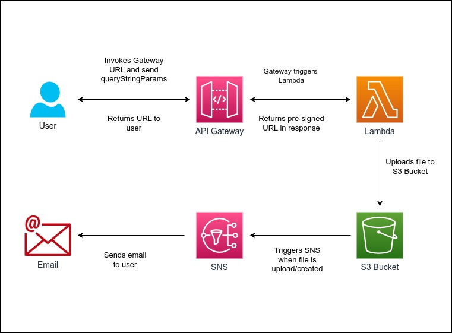
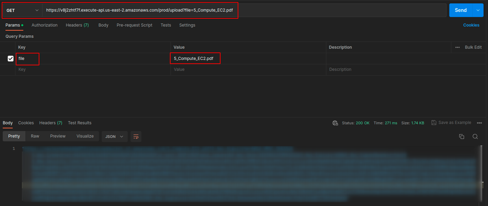
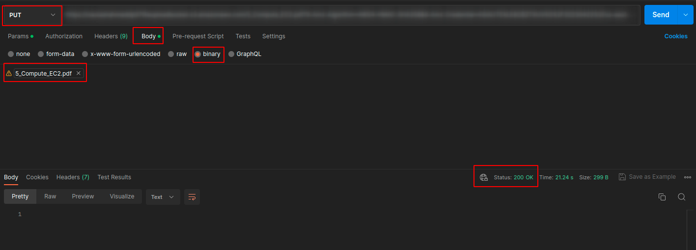

# Design Problem 07

## Problem Statement - Design & Develop

What if we have a 15MB file that we have to upload on S3 using API gateway. We have the limitation that our API gateway has the maximum payload capacity of 10MB. How will you solve this problem?

## Architecture Design

## API Gateway Endpoint
In this project, we have created **REST API** with **AWS API** Gateway backed by **Lambda**.

API Gateway will generate URL which will be used to send HTTP requests at. `GET` method can be used to send request to this URL generated by API Gateway along with the query string parameters.

To send the request
https://some-url/prod/upload?file=filename

## Pre-signed URL
When the `GET` request is sent, a pre-signed URL will be returned.

This pre-signed URL will be used to upload files to **S3 bucket** via `PUT` method.

The filename must be same as provided in the query string and needs to be sent in the binary format. This can be done through **POSTMAN**.

#### Get pre-signed URL

#### Upload file to S3 via pre-signed URL

A status code of `200` indicates that the file is been uploaded successfully.

When the file is uploaded to S3, an email will be sent to the registered email address by **SNS**.