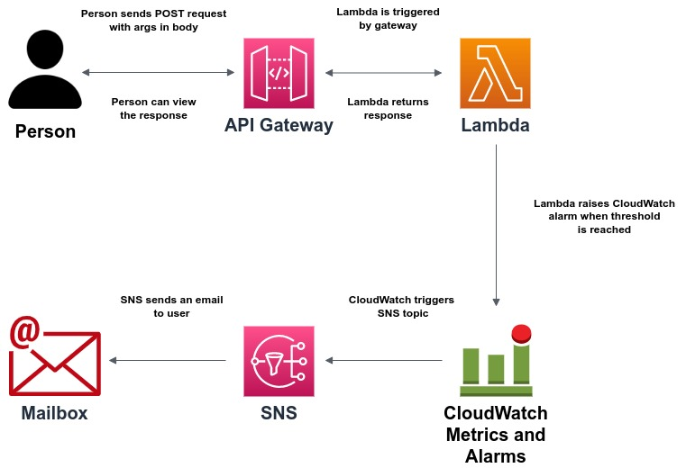

# Design Problem 01

The project is about sending the data in the body of **API Gateway** url and trigger **SNS** topic to send email when threshold is reached.

The **Lambda** will get triggered when send `POST` request and will raise **CloudWatch alarm** when threshold reaches. The CloudWatch will then trigger the **SNS**.

The threshold will be reached when `args > 10` condition is met and sent in the body of the `POST` request.

<br>

* [Seting up the Project](#seting-up-the-project)

* [AWS services used in this project](#aws-services-used-in-this-project)

* [Application Architecture Diagram](#application-architecture-diagrams)

* [API Gateway Endpoint Method(s)](#api-gateway-endpoint-methods)

* [Useful commands](#useful-commands)

<br>


## Seting up the Project

To start with the project:

Create a virtualenv on MacOS and Linux:

```
$ python3 -m venv .venv
```

After the init process completes and the virtualenv is created, you can use the following
step to activate your virtualenv.

```
$ source .venv/bin/activate
```

If you are a Windows platform, you would activate the virtualenv like this:

```
% .venv\Scripts\activate.bat
```

Once the virtualenv is activated, you can install the required dependencies.

```
$ pip install -r requirements.txt
```

At this point you can now synthesize the CloudFormation template for this code.

```
$ cdk synth
```

Finally, to deploy your stack to AWS.

```
$ cdk deploy
```

And if you have multiple AWS account configured then you need to pass the `--profile` parameter.

```
$ cdk deploy <PipelineStackName> --profile username
```

## AWS services used in this project

This project requires follwing services to run

- AWS Lambda
- IAM Role
- DynamoDB
- CloudFormation
- API Gateway

## Application Architecture Diagram


## API Gateway Endpoint Methods
In this project, we have created **REST API with AWS API Gateway** backed by **Lambda**.

API Gateway will generate URL which will be used to send HTTP requests at. Following method can be used to send request to this URL generated by API Gateway:

* **POST**

The method is being used for sending **POST** request.
https://api-url/prod/demo is used to send data. Data needs to be in the body in a `JSON` format

```
{
    "args": 10
}
```

## Useful commands

 * `cdk ls`          list all stacks in the app
 * `cdk synth`       emits the synthesized CloudFormation template
 * `cdk deploy`      deploy this stack to your default AWS account/region
 * `cdk diff`        compare deployed stack with current state
 * `cdk docs`        open CDK documentation