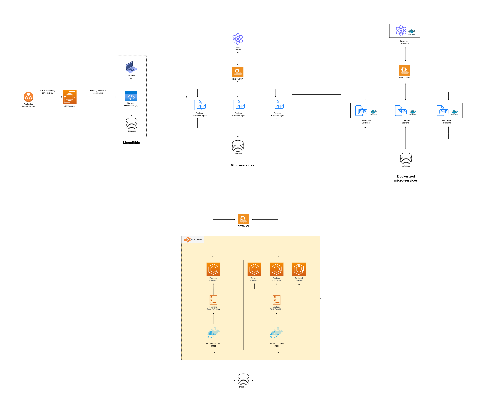
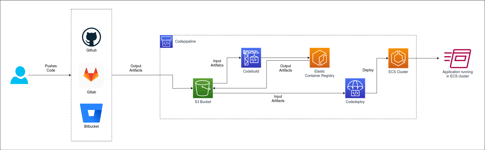

# Design Problem 08

## Problem Statement - Design

You are a DevOps engineer working at a big tech company and your manager has given you a task to migrate a three-tier PHP-based monolithic application to microservices. Consider the scenario that the application is running on a EC2 server with ALB in front of it. Now design an E2E architecture that would containerize the application.

**Expectation**:

* How the application would be migrated to microservices
* Need a running application of container based services
* The application should have an E2E CI/CD pipeline that would build the application and deploy the updated code/manifest on the container-based services
* Design the above architecture in draw.io 

## (I) Architecture Design

[SVG Format](https://github.com/nautash2022skipq/Sprint-07/blob/Design-Problem-08/public/images/DesignProblem08a.svg)

## (II) Pipeline Design

[SVG Format](https://github.com/nautash2022skipq/Sprint-07/blob/Design-Problem-08/public/images/DesignProblem08b.png)

## Expectation
> _How the application would be migrated to microservices?_

To migrate the application to the microservices, we need to do the following steps:

- Convert the monolithic application to microservices by separating the code for frontend and the backend (business logic)
- Create the APIs in backend code and call them in the frontend code
- Test the communication between frontend and backend through APIs and connectivity with the database
- Then containerize the frontend and backend applications in their own containers. Database is optional as it can be hosted on the Cloud as well
- Run the docker containers by `docker-compose`, or in **Kubernetes** or **ECS**

> _Need a running application of container based services_

* [Architecture Design](#i-architecture-design)

> _he application should have an E2E CI/CD pipeline that would build the application and deploy the updated code/manifest on the container-based services_

* [Pipeline Design](#ii-pipeline-design)