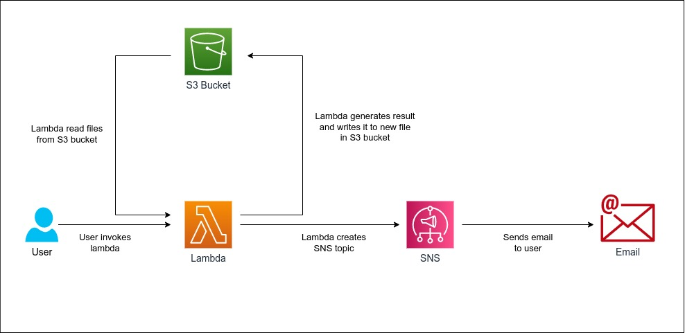

# Design Problem 05

## Problem Statement - Design & Develop

Suppose there are 10 files uploading to S3 bucket each day. For each file received on cloud storage, you have a mechanism to process the file. During the processing, your code parses the text and counts the number of times each word is repeated in the file. For example, in the following text: “Hello World and Hello There”, your code should be able to say that "hello" has been used twice, "world" has occurred once and so on. Then it will store the results in some storage and email to some email address after successful processing.

## Architecture Design
