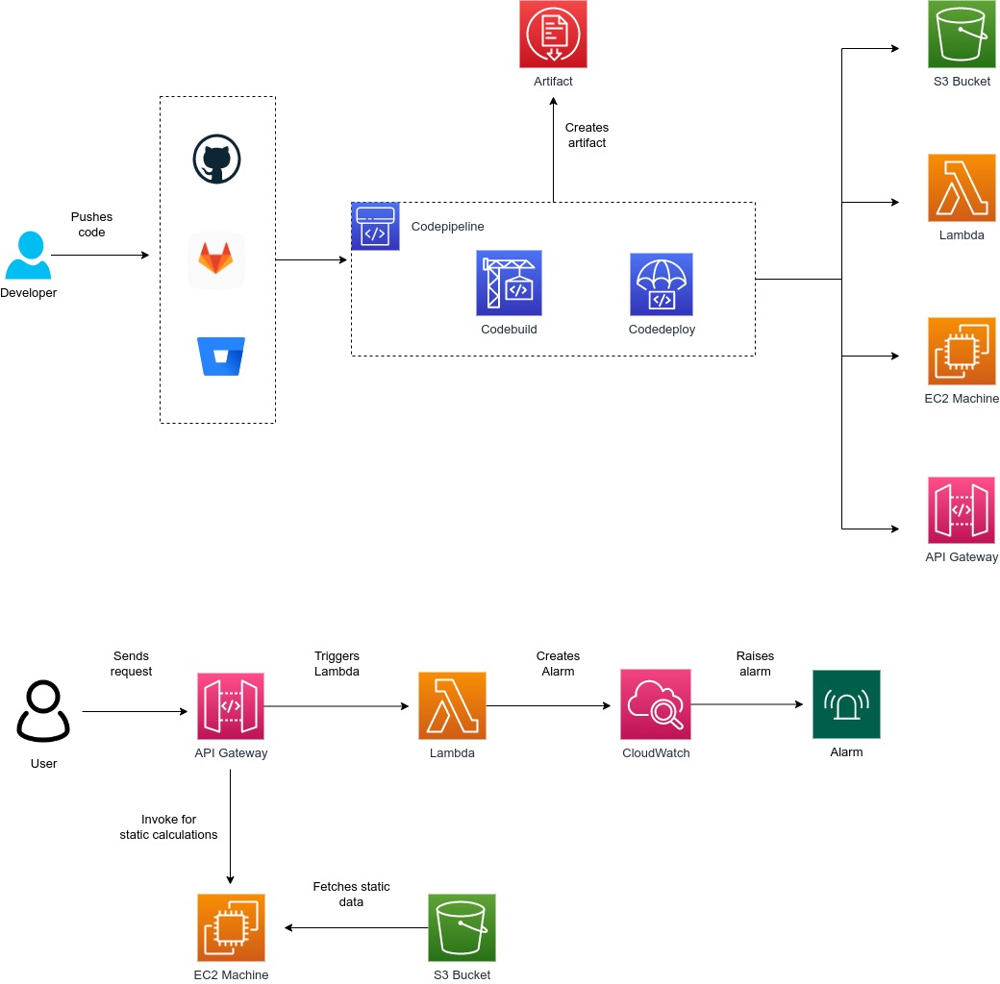

# Design Problem 03

## Problem Statement - Design

Design an end-to-end CI/CD delivery pipeline for a website on AWS that has following components:
1. EC2 instances for some static calculations
2. S3 for website pages
3. API GW and lambda triggers
4. CloudWatch alarms on number of API calls received

## Architecture Design
